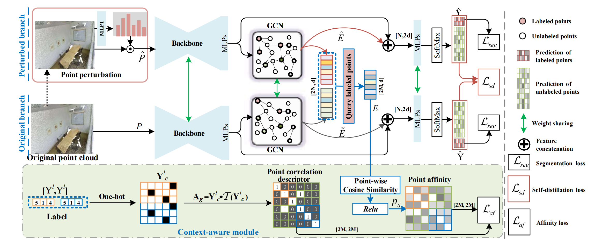

# Perturbed Self-Distillation: Weakly Supervised Large-Scale Point Cloud Semantic Segmentation

Mindspore implementation for ***"Perturbed Self-Distillation: Weakly Supervised Large-Scale Point Cloud Semantic Segmentation"***

Please read the [original paper](https://openaccess.thecvf.com/content/ICCV2021/papers/Zhang_Perturbed_Self-Distillation_Weakly_Supervised_Large-Scale_Point_Cloud_Semantic_Segmentation_ICCV_2021_paper.pdf)
or [original tensorflow implementation](https://github.com/Yachao-Zhang/PSD) for more detailed information.

## Model Architecture



## Requirements

- Hardware
    - For Ascend: Ascend 910.
    - For GPU: cuda==11.1

- Framework
    - Mindspore = 1.7.0

- Third Package
    - Python==3.7.5
    - pandas==1.3.5
    - scikit-learn==0.21.3
    - numpy==1.21.5

### Install dependencies

1. `pip install -r requirements.txt`
2. `cd third_party` & `bash compile_op.sh`

## Dataset

### Preparation

1. Download S3DIS dataset from
   this [link](https://docs.google.com/forms/d/e/1FAIpQLScDimvNMCGhy_rmBA2gHfDu3naktRm6A8BPwAWWDv-Uhm6Shw/viewform?c=0&w=1)
   .
2. Uncompress `Stanford3dDataset_v1.2_Aligned_Version.zip` to `dataset/S3DIS`.
3. run `data_prepare_s3dis.py` (in `src/utils/data_prepare_s3dis.py`) to process data. The processed data will be stored
   in `input_0.040` and `original_ply` folders.

### Directory structure of dataset

```html
dataset
└──S3DIS                                     #  S3DIS dataset
   ├── input_0.040
   │   ├── *.ply
   │   ├── *_proj.pkl
   │   └── *_KDTree.pkl
   ├── original_ply
   │   └── *.ply
   │
   └── Stanford3dDataset_v1.2_Aligned_Version
```

## Quick Start

For GPU:

```shell
bash scripts/train_eval_s3dis_area5_gpu.sh
```

For Ascend:

```shell
bash scripts/train_eval_s3dis_area5_ascend.sh
```

## Script Description

### Scripts and Sample Code

```html
RandLA
├── scripts
│   ├── train_eval_s3dis_area5_ascend.sh     # Train and Evaluate: S3DIS Area 5 on Ascend
│   └── train_eval_s3dis_area5_gpu.sh        # Train and Evaluate: S3DIS dataset on GPU
├── src
|   ├── data                                 # class and functions for Mindspore dataset
│   │   ├── dataset.py                       # dataset class for train
│   │   └── dataset_mask.py                  # dataset class for train_mask
│   ├── model                                # network architecture and loss function
│   │   ├── model.py                         # network architecture
│   │   ├── loss.py                          # loss function with gather logits and labels
│   │   └── loss_mask.py                     # loss function with mask
│   └── utils
│       ├── data_prepare_s3dis.py            # data processor for s3dis dataset
│       ├── helper_ply.py                    # file utils
│       ├── logger.py                        # logger
│       └── tools.py                         # DataProcessing and Config
├── third_party
|   ├── cpp_wrappers                         # dependency for point cloud subsampling
|   ├── nearest_neighbors                    # dependency for point cloud nearest_neighbors
|   └── data_prepare_s3dis.py                # data processor for s3dis dataset
|
├── 6_fold_cv.py
├── README.md
├── test.py
├── requirements.txt
├── train.py
├── train_mask.py
```

### Script Parameter

we use `train_eval_s3dis_area5_gpu.sh` as an example

```shell
python train_mask.py \
  --epochs 100 \
  --batch_size 3 \
  --labeled_point 1% \
  --val_area 5 \
  --scale \
  --device_target GPU \
  --device_id 0 \
  --outputs_dir ./runs \
  --name randla_Area-5-gpu
```

The following table describes the arguments. Some default Arguments are defined in `src/utils/tools.py`. You can change freely as you want.

| Config Arguments  |                         Explanation                          |
| :---------------: | :----------------------------------------------------------: |
| `--epoch`            | number of epochs for training |
| `--batch_size`       | batch size |
| `--labeled_point`    | the percent of labeled points  |
| `--val_area`         | which area to validate              |
| `--scale`            | use auto loss scale or not              |
| `--device_target`    | chose "Ascend" or "GPU" |
| `--device_id`        | which Ascend AI core/GPU to run(default:0) |
| `--outputs_dir`      | where stores log and network weights  |
| `--name`             | experiment name, which will combine with outputs_dir. The output files for current experiments will be stores in `outputs_dir/name`  |

## Training

### Training Process

For GPU on S3DIS area 5:

```shell
python train_mask.py --device_target GPU --device_id 0 --batch_size 3 --val_area 5 --labeled_point 1% --scale --name psd_mask_1%_Area-5-gpu --outputs_dir ./runs
```

For Ascend on S3DIS area 5:

```shell
python train_mask.py --device_target Ascend --device_id 0 --batch_size 3 --val_area 5 --labeled_point 1% --scale --name psd_mask_1%_Area-5-ascend --outputs_dir ./runs
```

### Training Result

Using `bash scripts/train_eval_s3dis_area5_ascend.sh` as an example:

Training results will be stored in `/runs/randla_Area-5-ascend` , which is determined
by `{args.outputs_dir}/{args.name}/ckpt`. For example:

```html
outputs
├── psd_mask_1%_Area-5-ascend
    ├── 2022-10-24_time_11_23_40_rank_0.log
    └── ckpt
         ├── psd_1_500.ckpt
         ├── psd_2_500.ckpt
         └── ....
```

## Evaluation

### Evaluation Process GPU and 910

For GPU on S3DIS area 5:

```shell
python -B test.py --model_path runs/psd_mask_1%_Area-5-gpu --val_area 5 --device_id 0 --device_target GPU --batch_size 20
```

For Ascend on S3DIS area 5:

```shell
python -B test.py --model_path runs/psd_mask_1%_Area-5-ascend --val_area 5 --device_id 0 --device_target Ascend --batch_size 20
```

Note: Before you start eval, please guarantee `--model_path` is equal to
`{args.outputs_dir}/{args.name}` when training.

### Evaluation Result 910

```shell
Area_5_office_6 Acc:0.9115031868178718
Area_5_office_7 Acc:0.9109614555866391
Area_5_office_8 Acc:0.9307005329945797
Area_5_office_9 Acc:0.9176830010623616
Area_5_pantry_1 Acc:0.7367233236155645
Area_5_storage_1 Acc:0.5244701058611868
Area_5_storage_2 Acc:0.6102852880754686
Area_5_storage_3 Acc:0.7138568287208468
Area_5_storage_4 Acc:0.793303764809178
--------------------------------------------------------------------------------------
62.13 | 91.49 97.67 80.84  0.00 20.02 60.45 53.17 75.09 83.07 71.33 68.04 56.68 49.86 
--------------------------------------------------------------------------------------
```

## Performance

### Training Performance

| Parameters                 | Ascend 910                                                   | GPU (3090) |
| -------------------------- | ------------------------------------------------------------ | ----------------------------------------------|
| Model Version              | PSD_mask                                                     | PSD_mask                                      |
| Resource                   | Ascend 910; CPU 2.60GHz, 24cores; Memory 96G; OS Euler2.8    | Nvidia GeForce RTX 3090                       |
| uploaded Date              | 11/26/2022 (month/day/year)                                  | 11/26/2022 (month/day/year)                   |
| MindSpore Version          | 1.7.0                                                        | 1.7.0                                         |
| Dataset                    | S3DIS                                                        | S3DIS                                         |
| Training Parameters        | epoch=100, batch_size = 3                                    | epoch=100, batch_size = 3                     |
| Optimizer                  | Adam                                                         | Adam                                          |
| Loss Function              | Softmax Cross Entropy                                        | Softmax Cross Entropy                         |
| outputs                    | feature vector + probability                                 | feature vector + probability                  |
| Speed                      | 3800 ms/step                                                 | 590 ms/step                                   |
| Total time                 | About 52 h 47 mins                                           | About 8 h 14 mins                             |
| Checkpoint                 | 57.26 MB (.ckpt file)                                        | 57.26 MB (.ckpt file)                         |

### Inference Performance

| Parameters          | Ascend                      |   GPU                      |
| ------------------- | --------------------------- |--------------------------- |
| Model Version       | PSD_mask                    | PSD_mask                 |
| Resource            | Ascend 910; OS Euler2.8     | Nvidia GeForce RTX 3090    |
| Uploaded Date       | 11/26/2022 (month/day/year) | 11/26/2022 (month/day/year)|
| MindSpore Version   | 1.7.0                       | 1.7.0                      |
| Dataset             | S3DIS                       | S3DIS                      |
| batch_size          | 20                          | 20                         |
| outputs             | feature vector + probability| feature vector + probability  |
| Accuracy            | See following tables        | See following tables       |

### S3DIS Area 5 (1% setting)

| Metric | Value(Tensorflow)|  Value(Mindspore, Ascend) |    Value(Mindspore, GPU)      |
| :----: | :------------:   |  :-------------------: |       :-------------------:      |
| mIoU |     62.0%          |         62.1%         |               60.7%               |

## Reference

Please kindly cite the original paper references in your publications if it helps your research:

```html
@inproceedings{zhang2021perturbed,
  title={Perturbed self-distillation: Weakly supervised large-scale point cloud semantic segmentation},
  author={Zhang, Yachao and Qu, Yanyun and Xie, Yuan and Li, Zonghao and Zheng, Shanshan and Li, Cuihua},
  booktitle={Proceedings of the IEEE/CVF International Conference on Computer Vision},
  pages={15520--15528},
  year={2021}
}
```